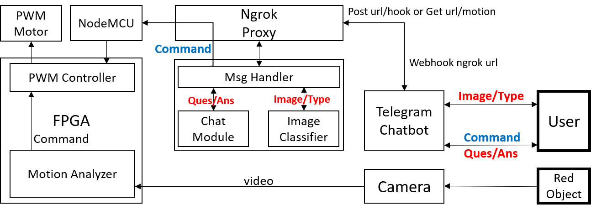

# FPGA-based-Connected-Car-with-CUI

此專案為106學年度成大工科系專題競賽之作品，由於該專案由多個模組構成，故僅在此列該專題之說明文件[0]
以及各分項Github頁面之url[1][2][3]。

專題由三位同學「合作完成」，本人負責聯網模組/Chatbot/FPGA PWM等相關模組撰寫，系統如圖。其中「對話介面」運行概念為透過Chatbot將訊息傳遞給綁定於本機的Proxy，本機運行程序收到訊息後，則對訊息分發，若為對話文字或照片則傳給基於RNN的Seq2Seq對話模組或是基於CNN的Inception分類模組，若是車控制指令，則傳給具聯網模組的自走車。

## 說明文件
[0]https://drive.google.com/file/d/0B5OUuL-nG1umMURVTnNGSkxEUXM/view?usp=sharing

## 繁體中文聊天機器人
[1]https://github.com/a3794110/traditional-chinese-chatbot-with-tensorflow

## NodeMCU聯網模組
[2]https://github.com/a3794110/NodeMCU-visit-url

## FPGA追蹤紅物體模組
[3]https://github.com/a3794110/FPFA_Image_Proccessing

